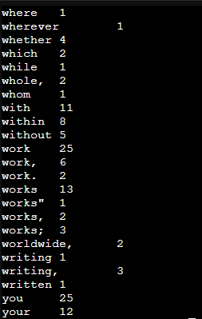

## Prerequisites
이번 포스트에서 사용한 소프트웨어들의 버전은 다음과 같습니다.
```
Software         Version
CentOS           9
Hadoop           3.3.6
Java             11
```
<br>

이번 포스트에서는 Hadoop Multinode Cluster 구성을 통해 높은 가용성을 가진 Hadoop 시스템을 구성하는 과정을 다룹니다. 이를 위해 아래와 같은 환경을 구성하였습니다.
```
HostName         IP Address       Purpose
hadoop-master    192.168.0.101    Hadoop 마스터 노드
hadoop-worker1   192.168.0.102    Hadoop worker node1
hadoop-worker2   192.168.0.103    Hadoop worker node2
```
<br>

## 1. Update Hosts File
각 노드에서 /etc/hosts 파일을 열고 아래와 같이 설정합니다.

    # vim /etc/hosts

```bash
192.168.0.101   hadoop-master
192.168.0.102   hadoop-worker1
192.168.0.103   hadoop-worker2
```

## 2. Add Hadoop User
하둡을 설치하고 실행하기 위해 hadoop이라는 사용자를 생성합니다. 이 사용자는 모든 노드에서 동일하게 생성해야 합니다.

    # adduser -m hadoop -G wheel
    # passwd hadoop

## 3. Install Java
노드에 Java를 설치하기 위해 다음과 같은 명령어를 사용합니다. 아래의 명령어는 최신 버전의 Java를 설치 하지만 다른 버전을 사용하셔도 무관합니다.

    # dnf install -y java-11-openjdk java-11-openjdk-devel
<br>

Hadoop에는 ***JAVA_HOME*** 환경 변수를 참조하는 코드 및 구성이 함께 제공됩니다. 이 변수는 Java 폴더를 가리키며, 이를 통해 Java 코드를 실행할 수 있습니다.
JAVA_HOME 환경 변수를 지정하기 위해 아래의 명령어를 사용합니다.

```console
# echo "JAVA_HOME=/usr/lib/jvm/java-11-openjdk" | tee -a /etc/environment
# source /etc/environment
# echo $JAVA_HOME
/usr/lib/jvm/java-11-openjdk
```
<br> 

## 4. Download Hadoop
2023-12-14일 기준으로 Hadoop의 최신 버전은 3.3.6입니다. Hadoop 3.3.6 버전을 다운로드 받은 뒤 압축 해제를 아래와 같이 진행합니다.

```console
# wget https://dlcdn.apache.org/hadoop/common/hadoop-3.3.6/hadoop-3.3.6.tar.gz
# tar xzf hadoop-3.3.6.tar.gz
# mv hadoop-3.3.6 /usr/local/hadoop
```
<br>

## 5. Configure Hadoop Master Node
이제 hadoop을 설치했으니 hadoop을 구성하는 단계입니다. 설정을 위해 hadoop 사용자로 로그인합니다.

```console
# su - hadoop
# vim .bashrc
```
```bash
# 가장 밑에 작성합니다.
export HADOOP_HOME=/usr/local/hadoop
export PATH=$PATH:$HADOOP_HOME/bin
export PATH=$PATH:$HADOOP_HOME/sbin
export HADOOP_MAPRED_HOME=$HADOOP_HOME
export HADOOP_COMMON_HOME=$HADOOP_HOME
export HADOOP_HDFS_HOME=$HADOOP_HOME
```
<br>

이제 hadoop의 구성 파일을 수정합니다. 먼저 ***hadoop-env.sh*** 파일에서 JAVA_HOME 환경 변수를 지정합니다.

    # vim /usr/local/hadoop/etc/hadoop/hadoop-env.sh
```bash
 52 # The java implementation to use. By default, this environment
 53 # variable is REQUIRED on ALL platforms except OS X!
 54 export JAVA_HOME=/usr/lib/jvm/java-11-openjdk
```
<br>

다음으로 core-site.xml 파일에서 NameNode의 위치를 hadoop-master의 9000번 포트로 지정합니다.

    # vim /usr/local/hadoop/etc/hadoop/core-site.xml
```xml
19 <configuration>
20         <property>
21                 <name>fs.default.name</name>
22                 <value>hdfs://hadoop-master:9000</value>
23         </property>
24 </configuration>
```
<br>

다음으로 ***hdfs-site.xml*** 파일을 수정합니다.<br>
**dfs.replication** 속성은 클러스터에서 데이터가 복제되는 횟수를 나타냅니다. 여기서는 두 작업자 노드에 모든 데이터가 복제되도록 2를 설정했습니다.
**dfs.namenode.name.dir** 속성은 HDFS의 네임노드 데이터를 저장할 디렉토리를 지정합니다. 이 디렉토리는 HDFS의 네임노드가 시작될 때 생성됩니다.<br>
**dfs.http.address** 속성은 네임노드의 웹 UI를 위한 HTTP 주소를 지정합니다.<br>
**dfs.secondary.http.address** 속성은 보조 네임노드의 웹 UI를 위한 HTTP 주소를 지정합니다.

    # vim /usr/local/hadoop/etc/hadoop/hdfs-site.xml
```xml
 19 <configuration>
 20         <property>
 21                 <name>dfs.replication</name>
 22                 <value>2</value>
 23         </property>
 24         <property>
 25                 <name>dfs.namenode.name.dir</name>
 26                 <value>/usr/local/hadoop/data/namenode</value>
 27         </property>
 28         <property>
 29                 <name>dfs.http.address</name>
 30                 <value>hadoop-master:50070</value>
 31         </property>
 32         <property>
 33                 <name>dfs.secondary.http.address</name>
 34                 <value>hadoop-worker1:50090</value>
 35         </property>
 36 </configuration>
```

마지막으로 ***mapred-site.xml*** 파일을 수정합니다. 이 파일은 MapReduce 프레임워크를 위한 설정 파일입니다. MapReduce 프레임워크는 하둡 클러스터에서 데이터를 처리하는 데 사용됩니다. 이 파일에서는 MapReduce Job Tracker를 hadoop-master의 62351번 포트로 지정합니다.

    # vim /usr/local/hadoop/etc/hadoop/mapred-site.xml
```xml
 19 <configuration>
 20         <property>
 21                 <name>mapred.job.tracker</name>
 22                 <value>master:62351</value>
 23         </property>
 24 </configuration>
```
<br>

이제 master 노드에서 worker 노드를 지정하기 위해서 workers 파일을 수정합니다.

    # vim /usr/local/hadoop/etc/hadoop/workers
```vim
  1 hadoop-worker1
  2 hadoop-worker2
```
<br>

## 6. Configure Hadoop Worker Nodes
이제 worker 노드에서 hadoop을 구성하는 단계입니다.
저는 여기서 master 노드 VM을 복사해서 worker 노드를 구성하였습니다.

worker 노드에서는 hdfs-site.xml 파일만 수정하면 됩니다. 이 파일에서는 데이터 노드의 데이터를 저장할 디렉토리를 지정합니다.

    # vim /usr/local/hadoop/etc/hadoop/hdfs-site.xml
```xml
 19 <configuration>
 20         <property>
 21                 <name>dfs.datanode.data.dir</name>
 22                 <value>/usr/local/hadoop/data/datanode</value>
 23         </property>
 24 </configuration>
```

## 7. SSH Key Pair
하둡 클러스터의 모든 노드에서 SSH를 사용할 수 있도록 SSH 키 쌍을 생성합니다. 설정은 ***Master***노드에서 진행합니다.

```console
# su - hadoop
# ssh-keygen        // 비밀번호 없이 Enter 누르고 계속 진행
# ssh-copy-id -i .ssh/id_rsa.pub hadoop@hadoop-master
# ssh-copy-id -i .ssh/id_rsa.pub hadoop@hadoop-worker1
# ssh-copy-id -i .ssh/id_rsa.pub hadoop@hadoop-worker2
```
<br>

## 8. Format HDFS
이제 HDFS를 포맷합니다. 이 명령은 HDFS의 네임노드를 초기화합니다. 이 명령은 마스터 노드에서만 실행해야 합니다.

    # hdfs namenode -format

## 9. Start Hadoop
hadoop 사용자로 마스터 노드에 로그인하고 아래 명령을 실행하여 hadoop 클러스터를 시작합니다.

    # start-dfs.sh

그러면 작업자 구성 파일의 구성에 따라 마스터 노드에서 NameNode 구성 요소가 시작되고 작업자 노드에서 DataNode 구성 요소가 시작됩니다.<br>
***Worker1***에서는 SecondaryNameNode 구성 요소도 시작됩니다.

각각의 노드에서 아래 명령어를 실행하여 Hadoop 클러스터의 상태를 확인합니다.

***Master*** 노드
    # jps
```bash
1367 Jps
942 NameNode
```
<br>

***Worker1 노드***
  
      # jps
```bash
1495 DataNode
1867 Jps
1613 SecondaryNameNode
```
<br>

***Worker2 노드***

      # jps
```bash
818 DataNode
924 Jps
```
<br>

## 10. MapReduce Wordcount Test
이제 Hadoop 클러스터가 정상적으로 작동하는지 확인하기 위해 MapReduce Wordcount 예제를 실행합니다. 이 예제는 Hadoop 클러스터에서 Wordcount 작업을 수행합니다. Wordcount.jar 파일은 인터넷에 검색하면 소스코드를 다운로드 받을 수 있습니다.

```console
[hadoop@hadoop-master ~]$ hadoop fs -mkdir -p /wordcount/input
[hadoop@hadoop-master ~]$ hadoop fs -put /usr/local/hadoop/LICENSE.txt /wordcount/input
[hadoop@hadoop-master ~]$ hadoop jar WordCount.jar com.care.WordCount.WordCount /wordcount/input /wordcount/output
[hadoop@hadoop-master ~]$ hadoop fs -cat /wordcount/output/part-00000
```
<br>

실행결과는 다음과 같습니다.<br>

